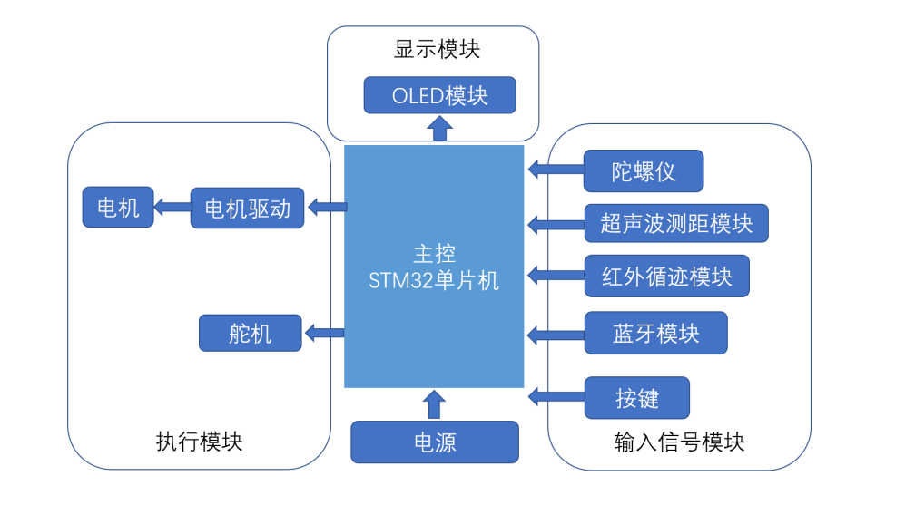
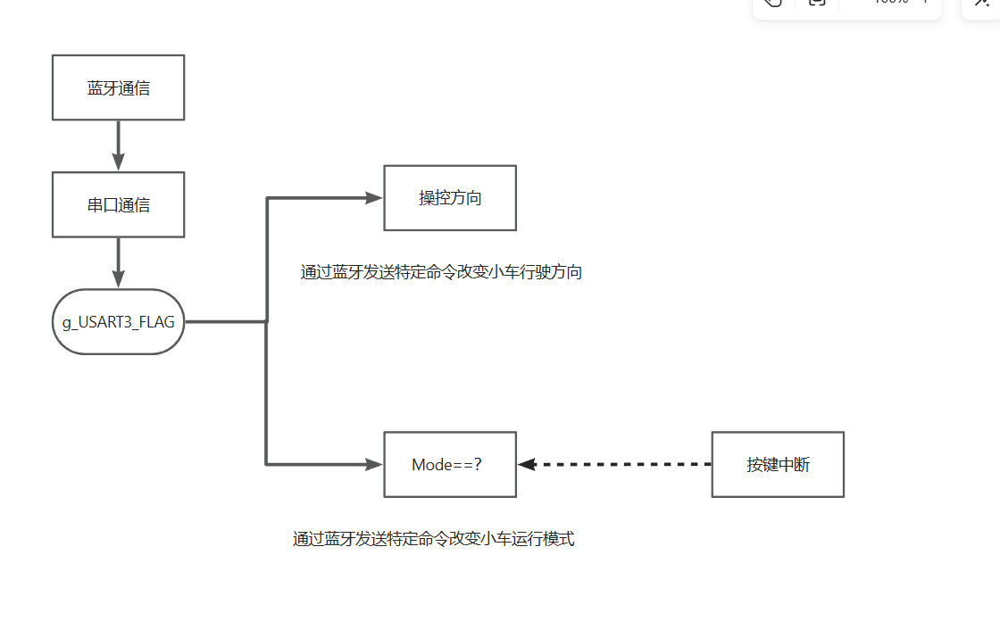
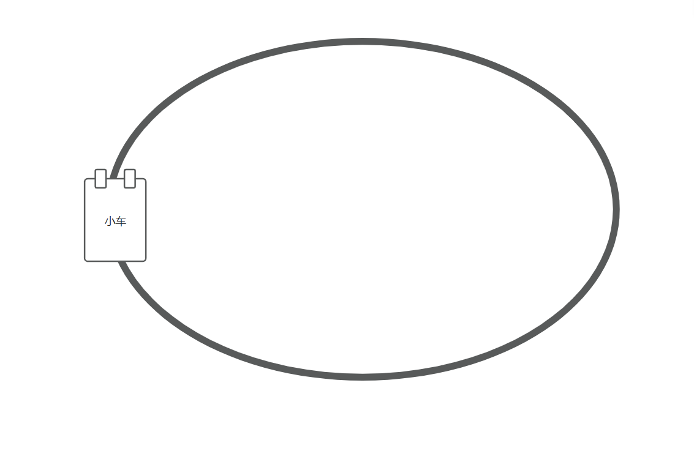
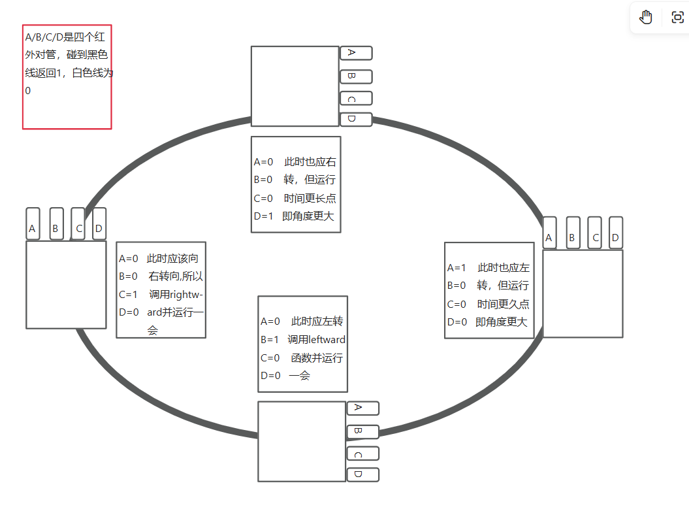
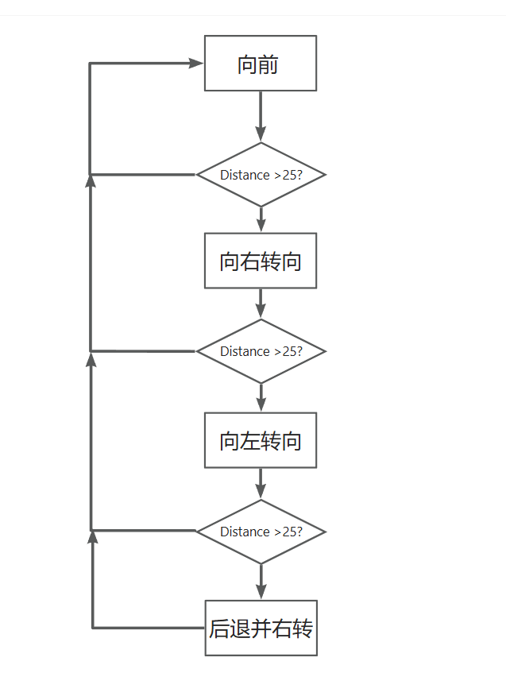

## 软件框架

## 外设
1. 蓝牙模块->USART3(PB11RX/PB10TX)->手机用蓝牙APP控制小车  
2. TB6612电机驱动模块->TIM1(CH1-PA8/CH4-PA11)->AIN1=PB13/AIN2=PB12、BIN1=PB1/BIN2=PB0
->AOUT控制小车左边电机运动，BOUT控制小车右边电机运动
3. 红外寻迹模块->PB3/PB0/PB5/PB15->用于红外寻迹功能  
4. OLED显示模块->PC14-SCL/PC15-SDA(I2C通信)->显示不同模式的数据  
5. 超声波测距模块->PA0(输出)/TIM2-CH2-PA1(输入捕获)->避障模式测距  
6. 舵机模块->TIM3-CH1-PA6->用于避障模式  
7. 按键->PA7/PA12->用于切换模式

## 各个模式的逻辑

> ### 蓝牙遥控模式

> ### 红外寻迹模式
#### 运行场景

#### 运行逻辑图析

> ### 避障模式

## 难点
1. 超声波测距运用了输入捕获，逻辑是超声波模块发送一个约10us的短脉冲，然后返回一段高电平，高电平的时间和距离成正比
我写了一篇博客记录它，链接如下：[超声波](https://mp.csdn.net/mp_blog/creation/editor/135938320)
2. 源码中大量运用了STM32的位带操作，虽然用的是正点原子的SYS文件可以直接用，但了解还是有必要的
我写了一篇博客记录它，链接如下：[位带操作](https://blog.csdn.net/2303_77401354/article/details/135976306?spm=1001.2014.3001.5501)
3. 避障小车大量运用了延时函数，而我自己写的延时函数因为标志判断疏忽导致偶尔会出现卡死现象
我写了一篇博客记录它，链接如下：[延时函数](https://mp.csdn.net/mp_blog/creation/editor/136001306)

